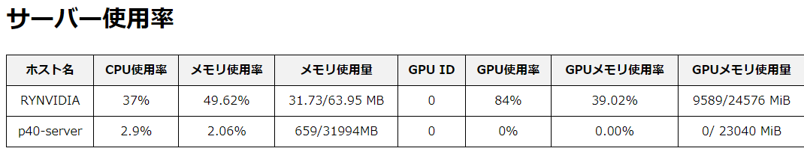

# PROCESS-MONITER:v0.0.1

このアプリケーションは、WindowsおよびLinux環境で動作するPCのリソース使用状況を監視し、ログを取得するツールです。主にGPUの使用状況に焦点を当てていますが、CPUやメモリの情報も収集します。

主な特徴：
- Windows（PowerShell）とLinux（Bash）の両環境に対応
- GPU、CPU、メモリの使用状況を定期的に記録
- 収集したデータをCSVファイルとして保存
- ブラウザで簡単に閲覧可能なフォーマットでデータを出力

このツールは、マルチGPU環境での資源管理や、長時間実行されるタスクのパフォーマンス分析に特に有用です。収集されたデータは、システムのボトルネックの特定や、リソース使用の最適化に役立ちます。
## 使用方法
### スクリプトの編集

#### gpu_process.sh (Linux/Unix用)
スクリプトを編集して、ログを保存するパスを変更します：
テキストエディタでgpu_process.shを開きます。
8行目にある以下の行を探します：
```bash
output_dir="/home/amembo/viwer/data/rynvidia"
"/home/amembo/viwer/data/rynvidia" を、ログを保存したい適切なパスに変更します。例：
bash
output_dir="/home/user/logs/gpu-info"
変更を保存して、ファイルを閉じます。
```
#### 実行 (Linux/Unix用)
gpu_process.shスクリプトを実行するには、以下の手順に従ってください：
ターミナルを開きます。
スクリプトのあるディレクトリに移動します：
```bash
cd /path/to/script/directory
```
スクリプトに実行権限を付与します：
```bash
chmod 775 gpu_process.sh
```
スクリプトをバックグラウンドで実行します：
```bash
./gpu_process.sh &
```
スクリプトがバックグラウンドで実行され、ターミナルを閉じても継続して動作します。スクリプトの出力は、指定したディレクトリ内のCSVファイルに記録されます。

### スクリプトの編集
#### gpu_process.ps1 (Windows用)

スクリプトを編集して、ログを保存するパスを変更します：

1. テキストエディタでgpu_process.ps1を開きます。
2. 6行目にある以下の行を探します：
   ```powershell
   $output_dir = "O:\GPU-info\p40"

    "O:\GPU-info\p40" を、ログを保存したい適切なパスに変更します。例：
    powershell
    $output_dir = "C:\Logs\GPU-info"
変更を保存して、ファイルを閉じます。


#### 実行(起動時の自動実行設定)

このスクリプトをWindows起動時に自動的にバックグラウンドで実行するには、以下の手順に従ってください：

1. Win + Rキーを押して「ファイル名を指定して実行」を開きます。

2. `shell:startup` と入力し、OKをクリックします。

3. スタートアップフォルダが開きます。

4. このフォルダ内で右クリックし、「新規作成」→「ショートカット」を選択します。

5. 「項目の場所を入力してください」というプロンプトが表示されたら、以下のコマンドを入力します：
```
powershell.exe -NoProfile -ExecutionPolicy Bypass -WindowStyle Hidden -File "C:\path\to\your\gpu_run.ps1"
```

注意: `C:\path\to\your\gpu_run.ps1` は、実際のスクリプトファイルのパスに置き換えてください。

6. 「次へ」をクリックし、ショートカットの名前（例：「GPU Monitor」）を入力して「完了」をクリックします。

これにより、Windowsの起動時にPowerShellスクリプトが自動的にバックグラウンドで実行されます。スクリプトの出力は非表示になりますが、スクリプトの出力は、指定したディレクトリ内のCSVファイルに記録されます。
この際、PowerShellのウインドウを消去しないようにしてください。


注意: スクリプトを正しく実行するために、PowerShellの実行ポリシーが適切に設定されていることを確認してください。必要に応じて、管理者権限のPowerShellで `Set-ExecutionPolicy RemoteSigned` を実行してポリシーを変更できます。

## Viewerの表示方法

Viewerを使用してデータを可視化するには、以下の手順に従ってください：

まず、viewerディレクトリに移動します：
```bash
cd /path/to/viewer
```
データディレクトリへのシンボリックリンクを作成します：


```bash
ln -s /path/to/data ./data
注意: `/path/to/data` は実際のデータディレクトリのパスに置き換えてください。
```
スクリプトに実行権限を付与します：
```bash
chmod 775 run.sh
```
run.shスクリプトを実行してViewerを起動します：
```bash 
./run.sh
```
Viewerが正常に起動すると、以下のURLでアクセスできます：

http://ホスト名:8080 

注意: 「ホスト名」は、実際のサーバーのホスト名またはIPアドレスに置き換えてください。

これで、ブラウザを通じてGPUリソースモニターのデータを可視化できます．